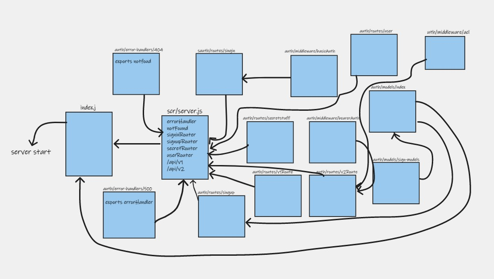

# auth-api
auth-api

## Getting Started

- add a actions to active CI/CD .
- install packages (express,dotenv,jest,supertest ,sequelize sequelize-cli pg sqlite3 base-64 bcrypt)
- to test the code run 'npm test'
- run the server by calling 'node index.js'
- in your browser open "http://localhost:3000/" to see the home page that loads (Home Route)
- in your browser open "http://localhost:3000/signin"
- in your browser open "http://localhost:3000/singup"
- in your browser open "http://localhost:3000/secret"
- in your browser open "http://localhost:3000/user"

- [PR](https://github.com/ManalKhAlbahar/auth-api/pull/1)
- [Github actions](https://github.com/ManalKhAlbahar/auth-api/actions)
